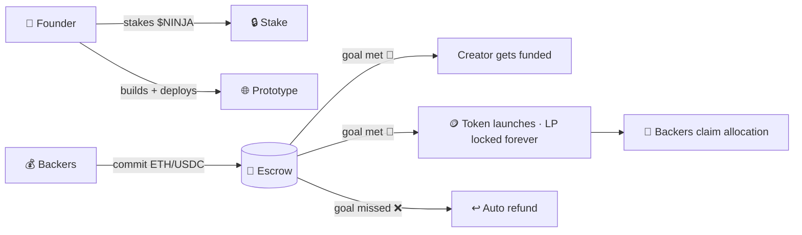

# 🥷 Factory Ninja

> **The prototype is the weapon.**
> *Build in stealth. Launch with proof.*

Everyone can make a token in five minutes. A logo, a story, a pump. That's exactly the problem — the market funds **promises**, and most promises die.

**Factory Ninja flips the order.** Here, you can't ask for money until you've already built something that works.

---

## 🎬 The scene

```
Ordinary launchpad        Factory Ninja
─────────────────         ─────────────────
logo + narrative    →     working prototype
"trust me bro"      →     "try it yourself"
raise first         →     build first
pump                  →     prove, then launch
```

One of these funds vaporware. The other funds builders.

## ⚔️ The play

A founder walks the **Nine Gates** — a guided gauntlet from idea to funded launch:

| | Gate | Vibe |
|---|---|---|
| 🔗 | **Connect** | Wallet in. Identity is your address. |
| 📝 | **Brief** | Name, ticker, chain, one sharp line. |
| 🩸 | **Pledge (Ninpō)** | Stake $NINJA + sign a written oath, public on your mission page. Skin in the game. |
| 🛠️ | **Forge (Dōjō)** | Build the prototype with **Sensei**, an AI builder that writes code with you — 100% in your browser. |
| 🌟 | **Throw (Shuriken)** | One click, and it's live at `yourproject.factory.ninja`. Real URL. Real proof. |
| ✅ | **Verify** | Auto-checked: site up, build green, content real. |
| ⚙️ | **Arm** | Set goal, deadline, and what backers get. |
| 📡 | **Live** | Backers commit ETH/USDC into **on-chain escrow**. Progress streams in real time. |
| 💥 | **Strike** | Goal met → escrow releases to you, token launches with locked liquidity, backers claim. Goal missed → everyone gets refunded. |

Nine gates. No shortcuts. That's the point.

## 🔄 How money moves



No trust required. The contract is the referee.

## 🧠 Why this wins

- 🛡️ **Scammers don't build.** A working prototype costs time, skill, and a slashable stake. Rugs get filtered *before* anyone's money is at risk.
- 🏦 **Escrow, not vibes.** Funds move by contract rules. The creator only gets paid when the crowd says the goal was hit.
- 🎖️ **Reputation compounds.** Finish a mission → earn **Mon** (your on-chain track record). Good builders get cheaper trust every time. Bad actors get priced out.
- 🌍 **Where the users are.** Base (Coinbase), Robinhood Chain, and Arc (Circle) — consumer chains, not degen backwaters.

## 🪙 $NINJA

A utility token with a job, not a governance decoration:

| Use | What it does |
|---|---|
| ⚡ **AI credits** | Pay for building with Sensei in the Dōjō |
| 🔒 **Founder stake** | Refundable bond that gates every mission — slashed if you abandon or rug |

Fixed supply. No admin mint. No transfer tax. Boring on purpose.

## 🎨 The vibe

Steeped in real shinobi history — the Iga and Kōka chronicles, the Bansenshūkai. Five principles run the whole product:

> 🗡️ Forbear · 🎯 Preparation beats improvisation · 🪓 One tool, many tasks · ☯️ Win without fighting · 🥷 Plain clothes, hidden capability

The UI is dark, blade-sharp, one vermillion accent. Copy is short and declarative. No hype. No exclamation marks. No cartoon ninjas.

## 🚦 Status

🟢 **Live on testnet now** — Base Sepolia · Robinhood Chain Testnet · Arc Testnet
🟡 Mainnet after audit

---

<p align="center">
<b>Ship unseen. Strike funded.</b><br/>
<sub>factory.ninja · less pitch, more proof</sub>
</p>
